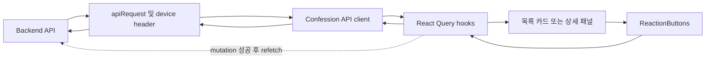

# 고해 반응 기능 Component Dependency

## Dependency Matrix

| Source | Target | Dependency Purpose | Change Need |
| ------ | ------ | ------------------ | ----------- |
| List/detail page | confession query hook | 화면 서버 데이터 조회 | 확인 |
| `ConfessionCard` | `ReactionButtons` | 목록 반응 표시 | 확인 |
| `DetailPanel` | `ReactionButtons` | 상세 반응 표시 | 확인 |
| `ReactionButtons` | model metadata | type, label, response 타입 사용 | 변경 |
| `ReactionButtons` | mutation hook | 선택 및 해제 의도 전달 | 변경 또는 확인 |
| mutation hook | API client | PUT/DELETE 호출 | 확인 |
| query hooks | API client | list/detail GET 호출 | 확인 |
| API client | `apiRequest` | HTTP 요청 전달 | 확인 |
| `apiRequest` | `getDeviceId` | `X-Device-Id` 생성 및 재사용 | 확인 |

## Communication Pattern

- **상향 입력 흐름**: backend response -> API client -> query hooks ->
  list/detail composition -> `ReactionButtons`.
- **하향 사용자 행동 흐름**: `ReactionButtons` click -> mutation hook ->
  API client -> shared HTTP client -> backend.
- **동기화 흐름**: mutation success -> query invalidation -> backend
  refetch -> 새 response render.

## Data Flow

### 텍스트 대체 표현

1. 조회 데이터는 backend에서 공통 HTTP client와 API/query 계층을
   거쳐 화면 및 반응 버튼으로 전달된다.
2. 버튼 클릭은 mutation hook과 API client를 통해 backend로 전달된다.
3. 성공한 mutation은 refetch를 유도하며, 새 서버 response가
   선택 상태와 count의 기준이 된다.

## Change Boundary

- `types.ts`와 `ReactionButtons.tsx`는 승인된 계약을 적용하기 위한
  직접 변경 대상이다.
- `confessionQueries.ts`는 기존 invalidation 흐름이 충분한지
  확인하며 필요 시 payload 또는 갱신 시점을 조정한다.
- `confessionApi.ts`, `httpClient.ts`, `deviceId.ts`,
  `ConfessionCard.tsx`, `DetailPanel.tsx`는 설계상 확인 우선 대상이며,
  불필요한 변경을 추가하지 않는다.
