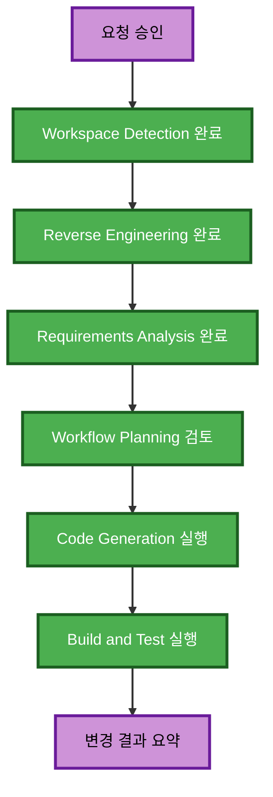

# 실행 계획

## 상세 분석 요약

### 변경 범위

- **변경 유형**: 단일 프론트엔드 애플리케이션의 설정 및 API wrapper 정리.
- **주요 변경**: Vite API base URL 예시와 ignore 규칙 정리, confession API
  path 기준 변경, Vercel 및 CORS 운영 메모 문서화.
- **관련 컴포넌트**: `src/shared/api`, `src/features/confession/api`,
  `.env.example`, `.gitignore`, `README.md`.

### 영향 평가

- **사용자 화면 영향**: 간접 영향. API 호출 대상과 경로 조립 기준을 바꾸지만
  화면 흐름과 작성 payload는 유지한다.
- **구조 영향**: 낮음. 기존 shared API client와 feature API wrapper 경계를
  유지한다.
- **데이터 모델 영향**: 없음. `content`와 `mood` payload 계약을 유지한다.
- **API 계약 영향**: 경로 기준만 `/api/confessions`로 맞춘다.
- **NFR 영향**: 배포 설정값과 CORS 운영 메모를 보완한다.

### 컴포넌트 관계

- **Primary Component**: `src/shared/api`와 confession API wrapper.
- **Shared Components**: device id storage helper.
- **Dependent Components**: confession query hooks와 page UI.
- **Supporting Components**: README와 Vite 환경변수 파일 예시.

### 위험 평가

- **Risk Level**: Low.
- **Rollback Complexity**: Easy.
- **Testing Complexity**: Simple.

## Workflow Visualization

### 텍스트 대안

1. Workspace Detection과 Reverse Engineering 산출물을 재사용한다.
2. 확정된 요구사항으로 Workflow Planning을 검토한다.
3. Code Generation에서 환경변수, API wrapper, README를 수정한다.
4. Build and Test에서 lint 또는 build 결과를 확인한다.

## 실행 단계

### INCEPTION PHASE

- [x] Workspace Detection - 완료.
- [x] Reverse Engineering - 완료.
- [x] Requirements Analysis - 완료.
- [x] User Stories - SKIP.
  - **Rationale**: 사용자 흐름을 새로 만들지 않는 설정과 API 연동 정리다.
- [x] Workflow Planning - IN PROGRESS.
- [x] Application Design - SKIP.
  - **Rationale**: 새 컴포넌트나 서비스 경계를 추가하지 않는다.
- [x] Units Generation - SKIP.
  - **Rationale**: 단일 프론트엔드 변경 묶음으로 구현할 수 있다.

### CONSTRUCTION PHASE

- [x] Functional Design - SKIP.
  - **Rationale**: 새 비즈니스 규칙이나 데이터 모델을 추가하지 않는다.
- [x] NFR Requirements - SKIP.
  - **Rationale**: 보안 메모와 배포 설정은 확정 요구사항으로 충분하다.
- [x] NFR Design - SKIP.
  - **Rationale**: 별도 보안 구조나 인프라 설계 변경이 없다.
- [x] Infrastructure Design - SKIP.
  - **Rationale**: Vercel과 Railway 실제 설정 변경은 범위 밖이다.
- [ ] Code Generation - EXECUTE.
  - **Rationale**: 소스와 배포 문서 변경이 필요하다.
- [ ] Build and Test - EXECUTE.
  - **Rationale**: 변경 후 가능한 정적 검증을 실행한다.

## 변경 순서

1. 환경변수 예시와 ignore 규칙을 운영 기준에 맞춘다.
2. 공통 API client의 명명과 base URL 오류 처리를 기존 구조에 맞춰 확인한다.
3. confession API path를 `/api/confessions` 기준으로 정리한다.
4. README에 Vercel, 로컬 개발, CORS 운영 메모를 추가한다.
5. build 또는 lint를 실행하고 결과를 기록한다.

## 성공 기준

- 프론트 소스에 Railway 운영 URL을 하드코딩하지 않는다.
- `.env.example`은 비밀값 없이 `VITE_API_BASE_URL=`을 제공한다.
- confession API wrapper가 공통 client에 `/api/confessions` path를 넘긴다.
- 작성 요청은 기존 `content`와 `mood` payload와 `X-Device-Id` 헤더 흐름을
  유지한다.
- README가 Vercel 환경변수 등록과 backend CORS 후속 작업을 설명한다.
- 검증 명령 결과가 사용자에게 요약된다.
