# 고해 반응 기능 Execution Plan

## 작업 계획 기록

- **Requirement summary**: 고해 목록과 상세에서 세 반응의 count 및
  현재 device의 선택 상태를 표시하고, 선택/해제 요청과 실패 경험을
  서버 기준 상태에 맞춰 제공한다.
- **Task type**: UI, API client, response model, server state 동기화,
  접근성 및 검증.
- **Selected AI-DLC execution mode**: Standard Track.
- **Reason for selected mode**: 사용자 대상 신규 인터랙션이며 기존
  feature 내부에서 해결 가능하지만, API 응답 계약과 상태 근거,
  오류 및 보안·신뢰성 요구가 여러 파일과 검증 항목에 걸친다.
- **Required context files**:
  - `aidlc-docs/inception/requirements/requirements.md`
  - `aidlc-docs/inception/user-stories/stories.md`
  - `src/features/confession/model/types.ts`
  - `src/features/confession/api/confessionApi.ts`
  - `src/features/confession/api/confessionQueries.ts`
  - `src/features/confession/ui/ReactionButtons.tsx`
  - `src/shared/api/httpClient.ts`
  - `src/shared/storage/deviceId.ts`
- **Expected files to change**:
  - `src/features/confession/model/types.ts`
  - `src/features/confession/ui/ReactionButtons.tsx`
  - 필요한 경우 `src/features/confession/api/confessionQueries.ts`
  - 필요한 경우 반응 표시 정규화 또는 테스트 관련 feature 파일
- **Files or directories that must not change**:
  - `aidlc-rules/aws-aidlc-rules/`
  - `aidlc-rules/aws-aidlc-rule-details/`
  - build 또는 deploy 설정 파일은 새로운 요구가 확인되지 않는 한 변경하지 않는다.
  - 기존 사용자 변경 또는 이미 존재하는 관련 없는 작업트리 변경은 되돌리지 않는다.
- **Validation commands**:
  - `npm run lint`
  - `npm run build`
  - 관련 테스트 script는 현재 `package.json`에 정의되어 있지 않으므로
    별도 명령을 추정해 실행하지 않는다.
  - 목록 및 상세의 반응 표시, 선택/해제, 실패와 비활성화 상태를
    브라우저에서 수동 확인한다.
- **Risks or assumptions**:
  - backend 조회 응답은 승인된 계약대로 각 반응에
    `selectedByMe: boolean`을 반환한다고 가정한다.
  - 공통 `apiRequest`는 이미 조회와 mutation 모두에 `X-Device-Id`
    헤더를 포함한다.
  - 현재 후보 구현은 localStorage 선택 기록에 의존하므로 서버 응답과
    충돌할 수 있으며 구현 보정이 필요하다.

## 계획 정정 기록

- **정정 일시**: 2026-05-27T05:18:08Z.
- **정정 사유**: 승인 직후 `Units Generation` 상세 규칙을 확인한 결과,
  이 단계는 `Application Design` 산출물을 필수 prerequisite로 요구한다.
- **영향**: 기존 후보 구현과 목표 범위는 바꾸지 않으며, 기존 component
  경계를 확인하고 단일 unit 정의를 가능하게 하는 최소 깊이의
  `Application Design`을 선행 실행 단계로 추가한다.
- **승인 상태**: 2026-05-27T05:20:11Z 정정 계획 승인 완료.

## 상세 분석 요약

### Transformation Scope

- **Transformation Type**: 기존 프론트엔드 feature 내부의 제한된 기능
  보정.
- **Primary Changes**: 반응 model에 서버 선택 상태를 포함하고,
  `ReactionButtons`가 이를 선택 표시의 기준으로 사용하도록 변경한다.
- **Related Components**: confession model, API/query 갱신 흐름,
  공통 반응 버튼, 목록 카드 및 상세 패널, 공통 device header client.

### Change Impact Assessment

- **User-facing changes**: Yes. 목록 및 상세에서 반응을 선택·해제하고
  상태와 오류를 확인한다.
- **Structural changes**: No. 기존 feature/API/UI 경계 안에서 수정한다.
- **Data model changes**: Yes. `ConfessionReaction`에
  `selectedByMe` 서버 필드를 반영한다.
- **API changes**: Yes. 기존 반응 endpoint에 더해 조회 응답의
  선택 상태 계약을 소비한다.
- **NFR impact**: Yes. 중복 요청 방지, 접근성 상태, 안전한 오류 표시,
  서버 기준 일관성 및 보안 요구가 있다.

### Component Relationships

- **Primary Component**: `ReactionButtons` 및 confession response model.
- **Infrastructure Components**: 없음. 이 저장소에서 deploy 또는
  backend infrastructure 변경을 수행하지 않는다.
- **Shared Components**: `apiRequest`, `getDeviceId`, React Query cache
  invalidation.
- **Dependent Components**: `ConfessionCard`, `DetailPanel`,
  `ConfessionListPage`, `ConfessionDetailPage`.
- **Supporting Components**: 수동 브라우저 검증과 lint/build script.

<!-- markdownlint-disable MD013 -->

| Component | Change Type | Change Reason | Priority |
| --------- | ----------- | ------------- | -------- |
| confession model | Minor | 서버 선택 상태 타입 반영 | Critical |
| `ReactionButtons` | Major | localStorage 대신 서버 기준 선택 표시와 안정적 selector 반영 | Critical |
| query mutation 흐름 | Minor or None | 성공 후 재조회가 서버 상태를 반영하는지 확인 | Important |
| `apiRequest` 및 `deviceId` | Verification-only | 필수 header 재사용 여부 확인 | Critical |
| list/detail composition | Verification-only | 두 화면 표시 및 이벤트 충돌 확인 | Important |

<!-- markdownlint-enable MD013 -->

### Risk Assessment

- **Risk Level**: Medium.
- **Rollback Complexity**: Moderate. 변경은 제한적이나 반응 선택
  표시가 서버 계약과 맞지 않으면 사용자 행동이 반대로 해석될 수 있다.
- **Testing Complexity**: Moderate. 성공, 해제, 복수 선택, 누락 타입,
  실패 및 목록/상세 동기화 확인이 필요하다.

## 단계 선택

### 실행 단계

<!-- markdownlint-disable MD013 -->

| Stage | Detail Level | Rationale |
| ----- | ------------ | --------- |
| Workflow Planning | Standard | 실행 범위와 생략 근거를 확정한다. |
| Application Design | Minimal | Units Generation의 필수 선행 산출물로서 기존 model, API, query, UI component 경계를 확인한다. |
| Units Generation | Minimal | API model과 UI 상태 변경을 단일 구현 unit으로 정의해 construction 산출물 경로를 확정한다. |
| Functional Design | Standard | 서버 기준 선택 상태, 누락 타입 정규화, mutation 후 갱신 및 UI 규칙을 명확히 한다. |
| NFR Requirements | Minimal | Security Full과 PBT Partial에서 프론트엔드에 적용 가능한 품질 기준을 unit에 연결한다. |
| NFR Design | Minimal | 오류 노출, pending 상태, 접근성 및 검증 전략을 구현 패턴으로 정리한다. |
| Code Generation | Standard | 승인된 설계를 기존 feature 경계 안에서 구현 보정한다. |
| Build and Test | Standard | lint/build와 수동 UI 동작 확인으로 회귀를 검증한다. |

<!-- markdownlint-enable MD013 -->

### 생략 단계

<!-- markdownlint-disable MD013 -->

| Stage | Skip Reason |
| ----- | ----------- |
| Infrastructure Design | 이 프론트엔드 변경은 deploy 구성, hosting 자원 또는 네트워크 구조를 변경하지 않는다. backend 보안 정책은 요구사항 추적으로 남긴다. |
| Operations | 운영 또는 배포 변경 요청이 없으며 현재 workflow에서 placeholder로 유지한다. |

<!-- markdownlint-enable MD013 -->

## Module Update Strategy

- **Update Approach**: Sequential.
- **Critical Path**: response model 확정 후 반응 UI가 서버 선택 상태를
  소비하고, query 재조회 동작과 목록·상세 경험을 검증한다.
- **Coordination Points**: `ConfessionReaction.selectedByMe`,
  `X-Device-Id`, React Query invalidation, 세 반응 constant.
- **Testing Checkpoints**: 타입 및 lint/build 확인 후, 목록과 상세에서
  서버 응답 기반 선택·해제·실패 흐름을 확인한다.
- **Rollback Strategy**: 구현 보정 파일을 기준으로 되돌릴 수 있지만,
  승인된 backend 계약과 맞지 않는 localStorage 기준 동작은 최종
  결과로 유지하지 않는다.

| Sequence | Module or Boundary | Scope |
| -------- | ------------------ | ----- |
| 1 | confession model | `selectedByMe`와 정규화 기준 반영 |
| 2 | reaction UI | 서버 상태 기준 버튼 표시, 오류·pending·selector 반영 |
| 3 | query/API integration | 성공 재조회와 필수 header 적용 확인 |
| 4 | list/detail surfaces | 두 화면 렌더링 및 navigation 충돌 검증 |

## Workflow Visualization

```mermaid
flowchart TD
    Start(["사용자 요청"])

    subgraph INCEPTION["INCEPTION"]
        WD["Workspace Detection<br/>COMPLETED"]
        RE["Reverse Engineering<br/>COMPLETED"]
        RA["Requirements Analysis<br/>COMPLETED"]
        US["User Stories<br/>COMPLETED"]
        WP["Workflow Planning<br/>COMPLETED"]
        AD["Application Design<br/>IN PROGRESS"]
        UG["Units Generation<br/>EXECUTE"]
    end

    subgraph CONSTRUCTION["CONSTRUCTION"]
        FD["Functional Design<br/>EXECUTE"]
        NR["NFR Requirements<br/>EXECUTE"]
        ND["NFR Design<br/>EXECUTE"]
        ID["Infrastructure Design<br/>SKIP"]
        CG["Code Generation<br/>EXECUTE"]
        BT["Build and Test<br/>EXECUTE"]
    end

    subgraph OPERATIONS["OPERATIONS"]
        OPS["Operations<br/>PLACEHOLDER"]
    end

    End(["완료"])

    Start --> WD --> RE --> RA --> US --> WP
    WP --> AD --> UG --> FD --> NR --> ND --> ID --> CG --> BT --> OPS --> End

    style Start fill:#CE93D8,stroke:#6A1B9A,stroke-width:3px,color:#000
    style End fill:#CE93D8,stroke:#6A1B9A,stroke-width:3px,color:#000
    style WD fill:#4CAF50,stroke:#1B5E20,stroke-width:3px,color:#fff
    style RE fill:#4CAF50,stroke:#1B5E20,stroke-width:3px,color:#fff
    style RA fill:#4CAF50,stroke:#1B5E20,stroke-width:3px,color:#fff
    style US fill:#4CAF50,stroke:#1B5E20,stroke-width:3px,color:#fff
    style WP fill:#4CAF50,stroke:#1B5E20,stroke-width:3px,color:#fff
    style AD fill:#FFA726,stroke:#E65100,stroke-width:3px,stroke-dasharray: 5 5,color:#000
    style UG fill:#FFA726,stroke:#E65100,stroke-width:3px,stroke-dasharray: 5 5,color:#000
    style FD fill:#FFA726,stroke:#E65100,stroke-width:3px,stroke-dasharray: 5 5,color:#000
    style NR fill:#FFA726,stroke:#E65100,stroke-width:3px,stroke-dasharray: 5 5,color:#000
    style ND fill:#FFA726,stroke:#E65100,stroke-width:3px,stroke-dasharray: 5 5,color:#000
    style ID fill:#BDBDBD,stroke:#424242,stroke-width:2px,stroke-dasharray: 5 5,color:#000
    style CG fill:#FFA726,stroke:#E65100,stroke-width:3px,stroke-dasharray: 5 5,color:#000
    style BT fill:#FFA726,stroke:#E65100,stroke-width:3px,stroke-dasharray: 5 5,color:#000
    style OPS fill:#BDBDBD,stroke:#424242,stroke-width:2px,stroke-dasharray: 5 5,color:#000
    linkStyle default stroke:#333,stroke-width:2px
```

### 텍스트 대체 표현

1. 완료: Workspace Detection, Reverse Engineering, Requirements Analysis,
   User Stories.
2. 완료: Workflow Planning.
3. 생략 또는 placeholder: Infrastructure Design, Operations.
4. 실행 중 또는 예정: Application Design, Units Generation, Functional Design,
   NFR Requirements, NFR Design, Code Generation, Build and Test.

## Success Criteria

- **Primary Goal**: 반응 선택 상태와 count가 backend 계약을 기준으로
  목록과 상세에서 신뢰성 있게 표시되고 변경된다.
- **Key Deliverables**: 단일 unit 정의, 기능 및 NFR 설계 산출물,
  기존 feature 보정 코드, 검증 결과.
- **Quality Gates**: 단계별 승인, server-selected-state 준수,
  Security/PBT 추적, lint/build 성공, 사용자 흐름 수동 확인.
- **Estimated Timeline**: 시간 추정 대신 각 승인 게이트를 통과한
  단계만 순차 실행한다.
