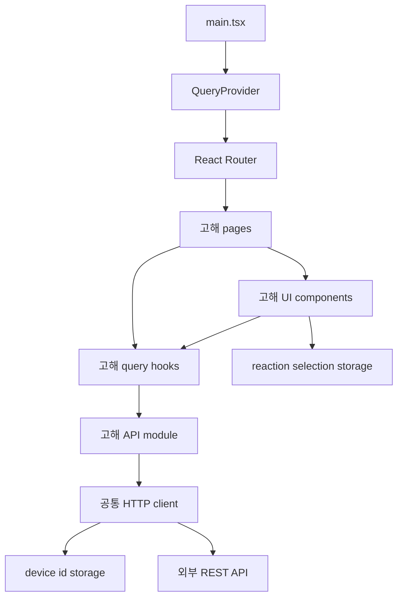
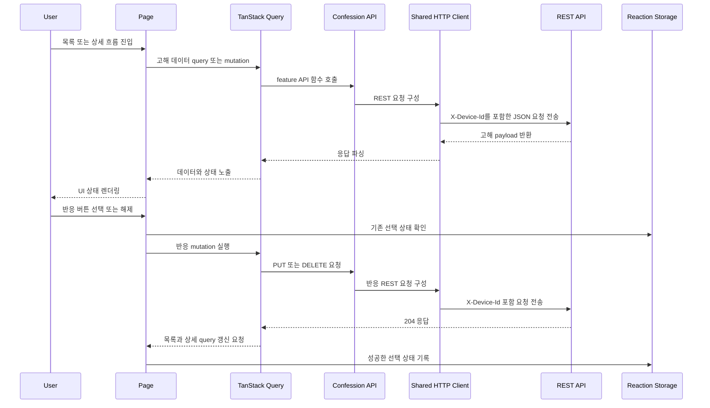

# 시스템 아키텍처

## 시스템 개요

이 워크스페이스는 단일 React 프론트엔드 애플리케이션이다.
페이지 이동에는 React Router를 사용하고, 서버 상태 조정에는 TanStack Query를
사용한다. REST 접근은 공통 HTTP 클라이언트가 담당하며 device id는 브라우저
`localStorage`에 유지한다. 반응 기능은 공통 버튼 component와 mutation
hook으로 구성되며, 성공한 반응 선택 여부는 브라우저에 함께 기록한다.

## 아키텍처 다이어그램

텍스트 대안:

1. `main.tsx`가 query provider와 router를 설치한다.
2. router가 목록, 작성, 상세 page를 렌더링한다.
3. page가 feature UI와 TanStack Query hook을 조합한다.
4. query hook이 고해 API module을 호출한다.
5. 반응 버튼은 query mutation과 선택 기록 storage를 사용해 반응 상태를
   렌더링한다.
6. API module은 브라우저 device id를 주입하는 공통 HTTP client로
   backend와 통신한다.

## 컴포넌트 설명

### 프론트엔드 애플리케이션

- **목적**: 브라우저에서 사용자 대상 고해 흐름을 렌더링한다.
- **책임**: 라우팅, page 구성, 서버 상태 조회 및 mutation 조정.
- **의존성**: React, React Router, TanStack Query, 공통 API 및 storage helper.
- **유형**: Application.

### 공통 HTTP 클라이언트

- **목적**: 설정된 backend base URL로 API 요청 형식을 통일한다.
- **책임**: JSON 요청 구성, `Content-Type` 헤더, `X-Device-Id` 헤더, 상태 오류 매핑, JSON 응답 파싱.
- **의존성**: `fetch`, Vite 환경 설정, device id storage helper.
- **유형**: Shared client.

### Device Identity Storage

- **목적**: 익명 요청을 브라우저 범위 id와 연결한다.
- **책임**: `localStorage`에서 UUID를 읽거나 생성한다.
- **의존성**: 브라우저 `crypto.randomUUID()`와 `window.localStorage`.
- **유형**: Shared utility.

### Reaction Selection Storage

- **목적**: 현재 device가 성공적으로 보낸 반응 선택을 UI 토글에 사용한다.
- **책임**: confession별 `ReactionType[]`를 `localStorage`에서 읽고
  갱신한다.
- **제약**: backend 조회 응답에는 현재 device의 선택 여부가 포함되지
  않으므로, 다른 환경에서 변경된 선택 상태는 자동으로 재구성하지 못한다.
- **유형**: Shared utility.

## 데이터 흐름

텍스트 대안:

1. page가 query 또는 mutation을 시작한다.
2. feature API가 요청 세부 처리를 공통 HTTP client에 위임한다.
3. HTTP client가 device 헤더를 포함해 backend로 요청한다.
4. query 상태가 로딩, 오류, 빈 상태, 성공 UI를 결정한다.
5. 반응 mutation 성공 후 query를 다시 조회하고, UI 선택 여부는 브라우저
   저장소에 기록한다.

## 연동 지점

- **외부 API**:
  - `GET /api/confessions`: 피드 데이터 및 반응 집계 조회.
  - `GET /api/confessions/:confessionId`: 상세 데이터 및 반응 집계 조회.
  - `POST /api/confessions`: 작성 흐름 처리.
  - `PUT /api/confessions/:confessionId/reactions/:type`: 반응 선택.
  - `DELETE /api/confessions/:confessionId/reactions/:type`: 반응 해제.
- **데이터베이스**: 이 프론트엔드 워크스페이스에는 선언되지 않음.
- **외부 서비스**: `VITE_API_BASE_URL`로 설정되는 backend 서비스.

## 인프라 컴포넌트

- **CDK Stacks**: 탐지되지 않음.
- **배포 모델**: Vite가 정적 프론트엔드 빌드를 생성하며 hosting 대상은 워크스페이스에 선언되지 않음.
- **네트워킹**: 브라우저가 설정된 REST endpoint와 통신하며 인프라 네트워크 정의는 탐지되지 않음.
