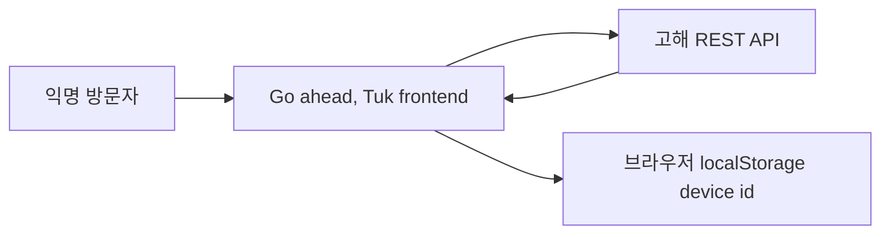

# 비즈니스 개요

## 비즈니스 컨텍스트 다이어그램

텍스트 대안:

1. 익명 방문자가 프론트엔드를 사용한다.
2. 프론트엔드는 생성한 device id를 브라우저 `localStorage`에 저장한다.
3. 프론트엔드는 외부 REST API를 통해 고해 데이터를 조회하고 생성한다.

## 비즈니스 설명

- **비즈니스 설명**: 이 애플리케이션은 익명 고해 공유와 위로 중심의 읽기 경험을 위한 모바일 우선 인터페이스를 제공한다.
- **비즈니스 트랜잭션**:
  - 고해 피드 둘러보기: 화면에 표시할 고해 요약 목록을 조회한다.
  - 고해 상세 읽기: 단일 고해와 선택적 위로 메시지를 조회한다.
  - 고해 게시하기: 고해 본문과 선택한 mood를 제출한 뒤 생성된 상세 화면으로 이동한다.
- **비즈니스 용어**:
  - **Confession**: mood, 생성 시각, 반응 수를 가진 사용자 작성 텍스트 항목.
  - **Mood**: 고해에 부여되는 지원 감정 범주 중 하나.
  - **Comfort message**: 고해 상세 응답에 포함될 수 있는 선택적 위로 문구.
  - **Device id**: `X-Device-Id` 헤더로 전송되는 브라우저 범위 식별자.

## 컴포넌트별 비즈니스 설명

### 애플리케이션 셸

- **목적**: 브랜드가 반영된 모바일 경험을 제공하고 고해 흐름 사이를 라우팅한다.
- **책임**: 레이아웃, 라우팅 outlet, 전역 데이터 provider 설정.

### 고해 피드

- **목적**: 방문자가 최근 고해를 훑어보고 새 고해를 시작하도록 돕는다.
- **책임**: 로딩 상태, 오류 복구, 빈 상태, 카드 렌더링, 새로고침 동작.

### 고해 작성

- **목적**: 게시 전에 고해 본문과 감정 mood를 수집한다.
- **책임**: 클라이언트 본문 길이 제한, mood 선택, create mutation, 성공 후 이동.

### 고해 상세

- **목적**: 전체 고해와 API가 반환한 위로 응답을 보여준다.
- **책임**: 상세 조회, fallback 처리, 재시도 수단, 피드 복귀 이동.
