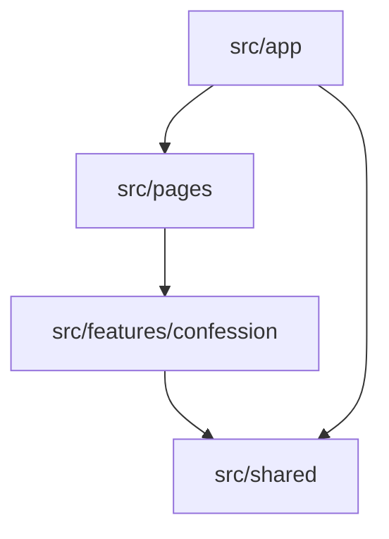

# 코드 구조

## 빌드 시스템

- **유형**: npm, TypeScript, Vite.
- **설정**: `package.json`, `vite.config.ts`, `tsconfig*.json`,
  `tailwind.config.ts`, `postcss.config.js`, `eslint.config.js`.

## 주요 모듈

텍스트 대안:

1. `src/app`은 provider와 routing을 포함한다.
2. `src/pages`는 route 수준 구성을 담당한다.
3. `src/features/confession`은 고해 API, model, 재사용 UI를 포함한다.
4. `src/shared`는 공통 API, storage, 범용 UI helper를 포함한다.

### 기존 파일 인벤토리

- `src/main.tsx` - 브라우저 진입점과 provider bootstrap.
- `src/app/providers/QueryProvider.tsx` - TanStack Query client provider와 기본
  query 정책.
- `src/app/routes/router.tsx` - 피드, 작성, 상세 page route 표.
- `src/pages/confession-list/ConfessionListPage.tsx` - 새로고침, 빈 상태,
  오류 상태, 고정 작성 CTA를 가진 피드 page.
- `src/pages/confession-create/ConfessionCreatePage.tsx` - 작성 page와 mutation
  성공 후 이동 처리.
- `src/pages/confession-detail/ConfessionDetailPage.tsx` - 상세 page와 재시도 상태 처리.
- `src/features/confession/api/confessionApi.ts` - REST endpoint wrapper.
- `src/features/confession/api/confessionQueries.ts` - query key, 조회 hook,
  create mutation invalidation.
- `src/features/confession/model/types.ts` - 도메인 type과 mood label.
- `src/features/confession/ui/ConfessionForm.tsx` - 제어형 고해 form과 mood selector.
- `src/features/confession/ui/ConfessionCard.tsx` - 피드 card 표현과 날짜 포맷.
- `src/features/confession/ui/DetailPanel.tsx` - 상세 본문과 comfort message panel.
- `src/shared/api/httpClient.ts` - 공통 fetch wrapper와 API error type.
- `src/shared/storage/deviceId.ts` - 브라우저 device id 유지.
- `src/shared/ui/AppLayout.tsx` - 브랜드 애플리케이션 frame.
- `src/shared/ui/EmptyState.tsx` - 공통 빈 상태 및 오류 상태 표현.
- `src/styles.css` - Tailwind layer와 page 배경 스타일.
- `src/assets/brand-identity.png` - 레이아웃 배경 이미지 asset.
- `src/vite-env.d.ts` - Vite typing 지원.

## 설계 패턴

### Feature 및 Shared 계층화

- **위치**: `src/features`, `src/pages`, `src/shared`, `src/app`.
- **목적**: page 조정 로직과 feature 동작, 재사용 primitive를 분리한다.
- **구현**: page는 feature hook과 component를 사용하고 shared module은
  브라우저와 API 공통 세부 동작을 처리한다.

### 서버 상태 hook

- **위치**: `src/features/confession/api/confessionQueries.ts`.
- **목적**: caching, query key, invalidation, 비동기 상태를 집중시킨다.
- **구현**: TanStack Query가 feature API module의 REST 함수를 감싼다.

### 얇은 endpoint wrapper

- **위치**: `src/features/confession/api/confessionApi.ts`.
- **목적**: route와 응답 type을 명시적으로 유지한다.
- **구현**: 작은 typed wrapper가 전송 처리를 `apiRequest`에 위임한다.

## 핵심 의존성

### React

- **버전**: `^18.3.1`
- **사용**: 렌더링과 component 상태.
- **목적**: UI framework.

### React Router

- **버전**: `^6.28.1`
- **사용**: 브라우저 routing과 navigation.
- **목적**: page 흐름 제어.

### TanStack Query

- **버전**: `^5.90.12`
- **사용**: fetch, cache, mutation, invalidation, loading status.
- **목적**: 서버 상태 관리.

### Tailwind CSS

- **버전**: `^3.4.17`
- **사용**: page와 feature component 전반의 utility-first styling.
- **목적**: UI styling system.
