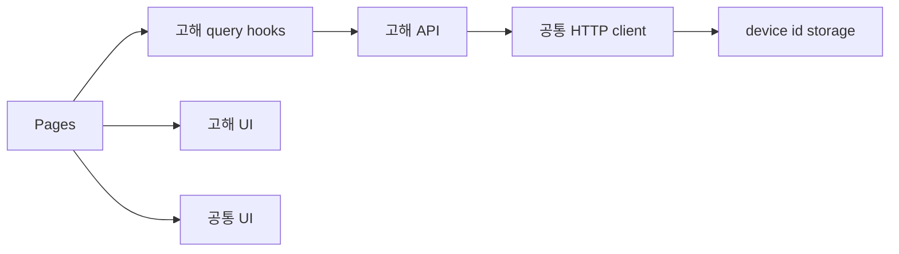

# 의존성

## 내부 의존성

텍스트 대안:

1. page는 feature query hook, feature UI, shared UI를 조정한다.
2. query hook은 endpoint wrapper에 의존한다.
3. endpoint wrapper는 공통 HTTP client에 의존한다.
4. HTTP client는 device id storage에 의존한다.

### Pages와 Feature Module

- **유형**: compile 및 runtime.
- **이유**: route 수준 page가 고해 흐름을 위해 feature UI와 data hook을 사용한다.

### Confession API와 Shared HTTP Client

- **유형**: compile 및 runtime.
- **이유**: endpoint wrapper가 하나의 request helper로 전송 동작을 집중시킨다.

### Shared HTTP Client와 Device Id Storage

- **유형**: runtime.
- **이유**: 각 요청이 익명 브라우저 범위 id 헤더를 전송한다.

## 외부 의존성

### `react` and `react-dom`

- **버전**: `^18.3.1`
- **목적**: 브라우저 UI 렌더링.
- **라이선스**: 이번 분석에서는 검증하지 않음.

### `react-router-dom`

- **버전**: `^6.28.1`
- **목적**: navigation, route matching, link.
- **라이선스**: 이번 분석에서는 검증하지 않음.

### `@tanstack/react-query`

- **버전**: `^5.90.12`
- **목적**: query caching, mutation 처리, invalidation.
- **라이선스**: 이번 분석에서는 검증하지 않음.

### `lucide-react`

- **버전**: `^0.468.0`
- **목적**: UI affordance용 icon component.
- **라이선스**: 이번 분석에서는 검증하지 않음.

### `clsx`

- **버전**: `^2.1.1`
- **목적**: class name 조합 helper. 현재 검사한 소스에서는 사용이 관찰되지 않음.
- **라이선스**: 이번 분석에서는 검증하지 않음.
